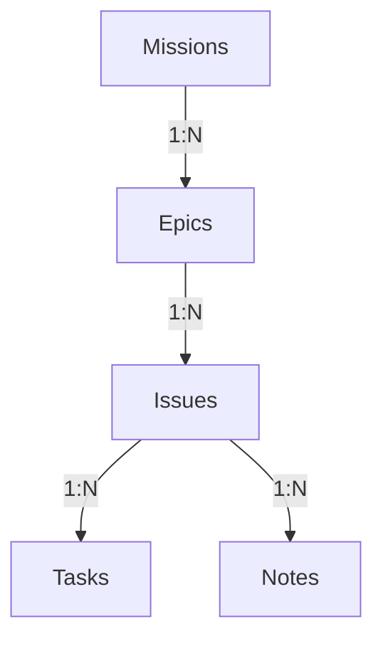

# 🚀 Engram 소개 및 기본 개념

**Engram**은 소프트웨어 개발 프로세스 및 에이전트 협업을 위해 설계된 강력한 로컬 퍼스트(Local-first) 이슈 관리 시스템입니다. 
개인 개발자뿐만 아니라 AI 에이전트와의 협업 과정을 체계적으로 트래킹하기 위해 고안되었습니다.

---

## 💡 주요 특징

1. **로컬 퍼스트 (Local-first)**
   * 중앙 집중식 서버가 아닌 사용자 개인 로컬 환경의 단일 SQLite 데이터베이스(`~/.engram/engram.db`)를 기반으로 동작합니다. 
   * 이를 통해 초고속 쿼리 속도, 완벽한 오프라인 작동성 및 안전한 데이터 프라이버시를 보장합니다.

2. **AI 에이전트 협업 설계**
   * 인간 개발자뿐만 아니라 AI 에이전트가 이슈와 태스크를 직접 할당받아 작업할 수 있도록 MCP(Model Context Protocol) 인터페이스를 내장하고 있습니다.
   * 에이전트가 수행한 변경 내역과 증거를 콘텍스트 노트로 기록하여, 사람이 투명하게 작업의 흐름을 검토하고 제어할 수 있습니다.

---

## 🏛️ Engram 데이터 구조 및 계층

Engram은 체계적인 로드맵 관리부터 미시적인 작업 추적까지 지원하는 5단계 계층 구조를 가집니다.

### 1. 미션 (Missions)
* 가장 상위의 장기적 목표 또는 분기별 큰 테마를 의미합니다.
* 예: `Phase 3 Desktop App UI 완성`, `성능 최적화 및 안정화`

### 2. 에픽 (Epics)
* 미션을 달성하기 위해 분할된 중형 프로젝트/기능 단위의 묶음입니다.
* 특정 스프린트에 할당되어 진행될 수 있습니다.
* 예: `칸반보드 컴포넌트 구현`, `Tauri IPC 통신 모듈 구축`

### 3. 이슈 (Issues)
* 실제로 개발자가 실행하고 완료해야 하는 핵심 작업 단위입니다.
* 이슈는 고유한 우선순위, 담당자(인간 또는 에이전트), 현재 상태를 가집니다.
* 에이전트 오작동 방지를 위해, 에이전트가 작업을 마친 이슈는 완료(`finished`) 상태로 직접 전이될 수 없으며 반드시 검토 대기(`demo`) 상태로 전이되어 인간의 승인을 받아야 합니다.

### 4. 태스크 (Tasks)
* 하나의 이슈를 해결하기 위해 쪼갠 미시적인 체크리스트(To-Do) 단위입니다.
* 실수 기반의 Fractional Index(`ord` 실수형 컬럼)를 차용하여 드래그 앤 드롭 정렬 시 데이터베이스 부하 없이 고속으로 순서를 재정렬할 수 있습니다.

### 5. 노트 (Notes)
* 이슈 진행 상황에 대한 구체적인 코멘트, 참고 자료, 코드 분석 로그 또는 에이전트의 작업 실행 증거(evidence) 등을 마크다운 형태로 기록하는 공간입니다.
