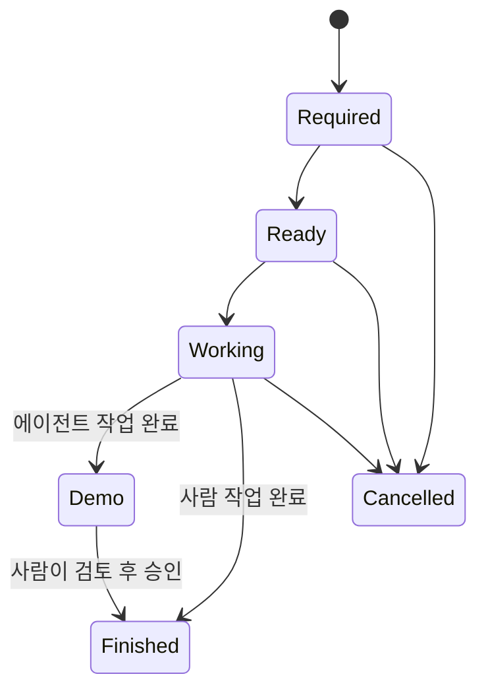

# 📋 이슈 및 태스크 관리

Engram의 생산성은 체계적인 이슈 상태 전이와 투명한 기록에서 나옵니다. 
이 가이드에서는 이슈와 태스크의 생명주기(Lifecycle), 담당자 배정, 그리고 에이전트 협업 시 지켜야 할 특수 보안 규칙에 대해 설명합니다.

---

## 🔄 이슈 상태 흐름 (Issue Lifecycle)

이슈는 다음 6가지 상태 중 하나를 가집니다.



* **Required**: 필요성이 제기되어 등록되었으나, 구체적인 분석이나 계획 수립이 덜 된 상태입니다. (백로그)
* **Ready**: 세부 태스크가 나열되었고 바로 개발에 들어갈 수 있는 준비 상태입니다.
* **Working**: 현재 담당자가 활발하게 작업을 수행 중인 진행 상태입니다.
* **Demo (검토 대기)**: 작업이 완료되어 개발자가 결과물(데모 코드, 테스트 결과 등)을 증거로 제시하고 최종 확인을 요청하는 단계입니다.
* **Finished (완료)**: 작업이 정상적으로 완수되어 최종 종결된 상태입니다.
* **Cancelled (취소)**: 기획 변경 등으로 인해 중단된 상태입니다.

---

## 🚨 에이전트 데모 게이트 (Agent Demo Gate) 규칙

Engram 시스템에서 **AI 에이전트(혹은 코드 어시스턴트)**는 시스템 안정성을 위해 다음과 같은 강력한 상태 전이 제약을 가집니다.

> [!IMPORTANT]
> **에이전트는 이슈 상태를 직접 `Finished` 또는 `Cancelled`로 변경할 수 없습니다!**
> 에이전트가 본인의 작업을 완료했을 때는 반드시 상태를 **`Demo`**로 전이해야 하며, 전이하기 직전에 `note_add` 도구를 활용하여 변경점 및 테스트 결과를 담은 콘텍스트 노트(Context Note)를 증거로 남겨야 합니다. 

이후 사용자가 제공된 노트를 확인하고 직접 UI나 CLI를 통해 이슈를 `Finished`로 전이하여 완료 처리하게 됩니다. 이 규칙은 오작동하는 에이전트가 코드를 깨뜨린 상태로 이슈를 멋대로 종결짓는 사고를 방지합니다.

---

## 📝 태스크 및 노트 작성 요령

### 1. 세분화된 태스크 (Tasks)
* 하나의 이슈를 단번에 풀려고 하지 말고, 20~30분 내외로 끝낼 수 있는 세부 태스크로 분할하세요.
* 칸반보드나 이슈 상세 화면에서 드래그 앤 드롭으로 우선순위에 따라 태스크 순서를 정렬할 수 있습니다.

### 2. 콘텍스트 중심의 노트 (Notes)
* 노트는 단순 메모장이 아닙니다. 코드 분석 결과, 외부 API 레퍼런스, 디버깅 로그 등을 적극적으로 기록하세요.
* 마크다운 렌더링을 완전히 지원하므로, 마크다운 표(Table)나 코드 스니펫(` ```rust `)을 활용해 가독성 높게 공유할 수 있습니다.
* 에이전트는 작업 교대(Session Handover) 시에 현재 상태와 남은 작업 목록을 노트로 기록하여 다음 에이전트가 작업 맥락을 끊김 없이 이어받을 수 있게 돕습니다.
